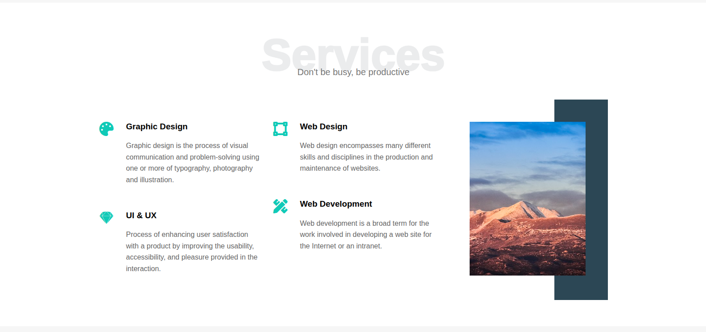

# 🌐 Leon Template 01 – Responsive Landing Page

This project is a responsive landing page built using HTML and CSS. It showcases a clean and modern design suitable for creative agencies, freelancers, or portfolio showcases. The layout is fully responsive and styled with Flexbox and CSS Grid, incorporating reusable components, consistent spacing, and modern UI techniques.


## 📋 Features

- ✅ Semantic HTML5 structure
- ✅ Custom CSS with variables and reusable utility classes
- ✅ Fully responsive layout (mobile-first)
- ✅ Clean navigation with dropdown menu
- ✅ Smoothly styled sections:
  - Header with logo and menu
  - Landing intro with hero text
  - Features section with icons
  - Services section with image and descriptions
  - Portfolio gallery with card layout
  - About section with image decorations
  - Contact section with styled email and social links
  - Footer


## 🎨 Technologies Used

- **HTML5**
- **CSS3**
- **Flexbox & CSS Grid**
- **CSS Variables**
- **Font Awesome** (for icons)
- **Google Fonts** (`Poppins`)
- **Normalize.css** (for consistent rendering)


## 📁 Folder Structure

```

Leon-Template/
├── index.html
├── CSS/
│   ├── leon.css
│   ├── normalize.css
│   └── all.min.css (Font Awesome)
├── Assets/
│   ├── logo.png
│   ├── landing.jpg
│   ├── services.jpg
│   ├── about.jpg
│   ├── portfolio-1.jpg
│   ├── portfolio-2.jpg
│   └── portfolio-3.jpg

```

## 🚀 How to Use

1. Clone or download this repository.
2. Open `index.html` in your browser.
3. Customize the content, text, images, and styles as needed.


## 📌 Notes

- This is a static template and does not include JavaScript functionality.
- You can deploy this page on GitHub Pages, Netlify, or Vercel for free.


## 📺 Source Course

This project was created as part of the [Elzero Web School](https://www.youtube.com/playlist?list=PLDoPjvoNmBAzHSjcR-HnW9tnxyuye8KbF)  
**HTML & CSS Template 01** playlist on YouTube.  
It focuses on practicing modern frontend layout techniques and clean UI structuring.

## Live Projects

- [Project 001 - Basic Website](https://hocine-bec.github.io/Frontend-Practice/Project-001-Basic-Page/)


## 📷 Preview
***Service Page***



## 📝 License

This project is open for personal and educational use. Attribution appreciated but not required.
