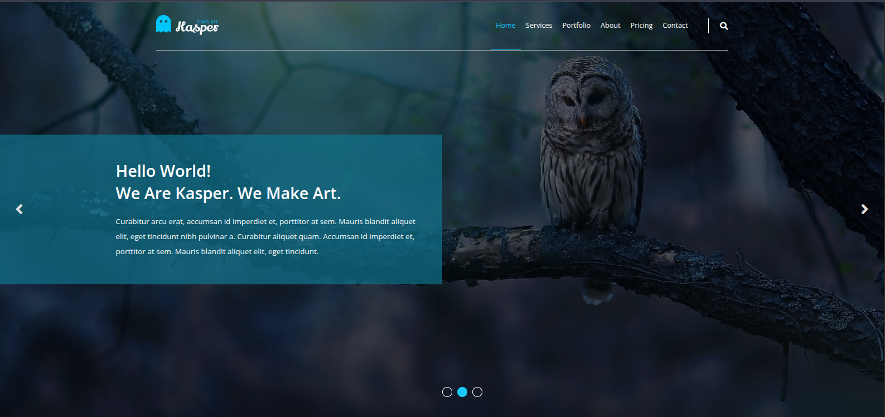

# 🎨 Kasper Template – Modern Creative Agency Landing Page

This project is a responsive creative agency landing page built with HTML and CSS. It features a sleek, modern design with smooth animations and interactive elements, perfect for creative studios, designers, or digital agencies.

## ✨ Features

- ✅ Fully responsive layout (mobile-first approach)
- ✅ Clean, modern UI with attention to detail
- ✅ Interactive elements including:
  - Animated navigation
  - Image gallery with hover effects
  - Skill progress bars
  - Pricing tables
- ✅ Comprehensive sections:
  - Hero section with overlay text
  - Services with icon boxes
  - Portfolio with filterable gallery
  - Video background section
  - About us with stats counter
  - Skills and testimonials
  - Pricing plans
  - Contact form
  - Footer with social links

## 🛠 Technologies Used

- **HTML5** (semantic structure)
- **CSS3** (Flexbox, Grid, animations)
- **CSS Variables** (for consistent theming)
- **Font Awesome** (icon library)
- **Google Fonts** (Open Sans)
- **Normalize.css** (cross-browser consistency)

## 📂 Folder Structure

```
Kasper-Template/
├── index.html
├── CSS/
│   ├── Kasper.css
│   ├── normalize.css
│   └── all.min.css (Font Awesome)
├── images/
│   ├── logo.png
│   ├── landing.jpg
│   ├── design-features.jpg
│   ├── about.png
│   ├── stats.png
│   ├── quote.jpg
│   ├── subscribe.jpg
│   ├── mobile.png
│   ├── awesome-video.mp4
│   ├── skills-01.jpg
│   ├── skills-02.jpg
│   └── shuffle-01.jpg to shuffle-08.jpg
```

## 🚀 How to Use

1. Clone or download the repository
2. Open `index.html` in your browser
3. Customize content, images, and colors to match your brand

## 🌟 Key Design Elements

- **Hero Section**: Full-screen background with overlay and navigation
- **Services**: Clean icon-based layout
- **Portfolio**: Filterable masonry-style gallery
- **Video Background**: Engaging full-width video section
- **Stats Counter**: Animated number counters
- **Testimonials**: Client feedback with avatar images
- **Pricing Tables**: Four-tier pricing plans
- **Contact Form**: Fully styled contact section

## 📺 Source Inspiration

This project was inspired by modern web design trends and created as part of front-end development practice. It demonstrates advanced CSS techniques including:

- Complex grid layouts
- CSS animations and transitions
- Responsive design principles
- Form styling techniques

## 🖥️ Live Preview

[View Live Demo](https://hocine-bec.github.io/Frontend-Practice/Project-002-Kasper-WebPage/)

## 📷 Screenshots
***Hero Section***


## 📝 License

Open for personal and commercial use. Attribution appreciated but not required.
